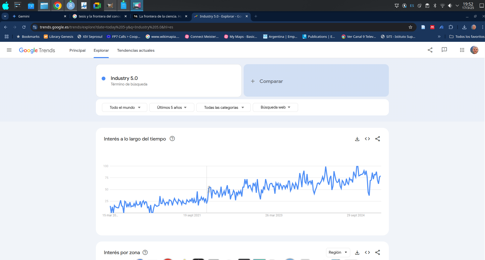

```{r setup, include=FALSE}
knitr::opts_chunk$set(echo = FALSE)
```

# De la Hipótesis a la Tesis:


Ricardo R. Palma [rpalma\@uncu.edu.ar](mailto:rpalma@uncu.edu.ar){.email}

Parte 1 de 4

## UNIDAD I:

-   La investigación científica: características y etapas.
-   Normas para citas.
-   Plagio. Herramientas bibliométricas para la detección de Plagios.
-   Elección del tema,
-   Lectura de tesis y artículos en los que dejan líneas de investigación abiertas.
-   Lecturas para trabajos en clase, consignas para elaboración de trabajos prácticos.
-   Taller de uso de herramientas de análisis cuali/cuantitativo RQDA (<https://rqda.r-forge.r-project.org/>)

## La investigación científica

-   Casi siempre que comenzamos a fantasear (soñar) con la idea de hacer un doctorado nos enfrentamos a un problema común a todos los tesistas.

-   Ingresar a un doctorado requiere que presentemos un plan de trabajo para hacer nuestra tesis, pero jamás hemos hecho una !!!. ¿Cómo es posible hacer esto?

-   En el caso del $Di³$ hay que presentar los formularios F1 y F2. El primero es justamente el plan de trabajo con el que serás evaluado por 4 años.

La respuesta a esto es tener en cuenta que un doctorado es parte de las actividades científicas y por ello debes respetar las prácticas que allí se desarrollan.

-   **La ciencia avanza por que se comunicas**

## Formularios Di3

| Formulario F1 - Plan     | Formulario F2 - Director |
|--------------------------|--------------------------|
| {width="80%"} | {width="80%"} |

: Formularios Di3

## A hombros de gigante

-   Uno de los **trucos** posibles es leer artículos científicos (papers)

-   La estrucutra comunicacioneal de un paper es "semejante a la de una TESIS"

-   Jamás busques inspiración en la web (carrot)

-   Es preferible trabajar a hombros de [GIGANTE](https://www.google.com.ar)

-   Durante tu primer año de doctorado deberás leer unos 700 papers, de uno a tres de ellos serán útiles para tu tesis. El resto es capital de trabajo.

## En qué áreas desarrollarás tu tesis

**Clasificación de la UNESCO**

11 - Lógica 12 - Matemáticas 21 - Astronomía y Astrofísica 22 - Física 23 - Química 24 - Ciencias de la Vida 25 - Ciencias de la Tierra y del Espacio 31 - Ciencias Agrarias 32 - Ciencias Médicas 33 - Ciencias Tecnológicas 51 - Antropología 52 - Demografía 53 - Ciencias Económicas 54 - Geografía 55 - Historia 56 - Ciencias Jurídicas y Derecho 57 - Lingüística 58 - Pedagogía 59 - Ciencia Política 61 - Psicología 62 - Ciencias de las Artes y las Letras 63 - Sociología 71 - Ética 72 - Filosofía 75 - Ciencias Aplicadas **75.4 Ingeniería Industrial**

## Tesis que han fracasado

-   Hice una muy buena tesis de maestría, trabajé mucho. La quiero continuar como tesis de doctorado.

-   Voy a hacer una tesis sobre cómo fabricar biopolímeros a partir de basura.

-   Quiero hacer una tesis que aborde la complejidad de implementar inteligencia atificial basadas en las limitaciones de las estrategias de enseñanza aprendizaje que utilizamos en la acreditación.

-   Quiero hacer la tesis para cambiar al mundo.

-   Quiero hacer una tesis para implementarla en mi emprendimiento (EBT , PDTS).

## Que espera la CONEAU de las tesis

Marco de referencia Res 360/98 CONEAU

Es el organismo de acreditación de carreras de grado y posgrado en Argentina

-   Tesinas de Grado - puede ser un proyecto

-   Trabajo Final de Especialización

-   Tesis o Trabajo Final de Maestría

-   Tesis Doctoral

Ninguna de ellas es más importante ni más prestigiosa que las otras

Tienen un sentido y alcance muy distinto.

## Tesina de grado

-   Puede ser un proyecto siguiendo la metodología de Naciones Unidas

-   Se pretende que el alumno exponga todo (o casi todo) lo que vio en la carrera ingeniería industrial.

-   Sus referencias bibliográficas deberían apuntar a los libros que los profesores han utilizado en la formación.

-   Deben abundar en planos, canvas, flujos de fondo, ingeniería de detalle, etc.

## Tesina de grado

-   Mientras más extensa mejor

-   Otorgan competencias

-   Deben utilizar procedimiento y normas de la profesión

-   Se espera que puedan servir a los emprendedores como start-up

-   Tienen plantillas .dot .dotx y adoptan normas de cita formales.

## Diplomaturas

-   Las diplomaturas no están acreditadas por CONEAU

-   No requieren trabajo final

-   Algunas incluso no realizan evaluación y emiten certificado de asistencia

-   Académicamente son un curso de extensión universitaria

-   Se puede ingresar con diploma de la secundaria o sin él

## Especializaciones

-   Apuntan a ahondar en los conocimientos de una carrera

-   El alumno se especializa hasta llagar a conocer TODO el corupus de conocimiento , procedimientos, normas y prácticas que el **CONSEJO PROFESIONAL** sugiere.

-   Es necesario tener el título de Ingeniero Industrial

-   Ejemplo de CE - Especialización de derecho tributario de PyME familiares con sucesión indivisa. (Sabe más que el abogado sobre el tema.)

-   Otorga competencias

-   Habilita para peritaje.

## Tesis de Maestría

-   Buscan que el tesista sea capaz de hacer lectura de los avances en el campo científico y la innovación y los transfieran a la empresa, gobierno o sociedad.

-   Estructura: Situación problema, Hipótesis, Materiales y Métodos, Diseño de experimento y encuestas, Caso de Estudio, Interpretación de resultados, Aportes y contribución, Discusión final, Líneas futuras, Referencias Bibliográficas y Anexos

-   Se basan en una investigación metódica (cualitativa, cuantitativa o mixta)

-   Tienen formato y estilo que supera las normas de la Universidad

-   No requieren publicación, si presentación en congresos.

## Tesis de Maestría

-   Ser de carácter Original Relevante y tener Rigurosidad Metodológica

-   Deben soportar protocolos de detección de plagio. Ser coherente y pertinente

-   Pueden ser refutadas o anuladas aún años después de su sustentación

-   Demostrar dominio del campo epistémico por parte del tesista.

## Tesis doctorales

-   El tesista debe correr la frontera del conocimiento un paso hacia adelante.
-   El tema debe ser de una línea de investigación activa (de moda) - ver *ngrams*
-   La tesis debe estar vinculada a una comunidad epistémica (escuela de pensamiento)
-   Estas vinculada a editoriales y revistas que publiquen sobre el tema
-   Tienen que tener una publicación Q1 o excepcional mente Q2
-   No te vincules a editoriales que usan Word como si fuese plantilla, prefiere $LaTEX$.
-   Puedes validar tu publicación con un pre-print
-   Has al menos 2 publicaciones a) Review estado del arte b) Tu tesis en 10 pág.

## Google ngrams

| Pañales                       | Industria 4.0                 |
|-------------------------------|-------------------------------|
| {width="80%"} | {width="80%"} |

## Google Trends 1 de 2

{width="80%"}

## Google Trends 2 de 2

{width="80%"}

## Indice de felicidad de la tesis


## Vinculante a un Laboratorio

{width="90%"}
